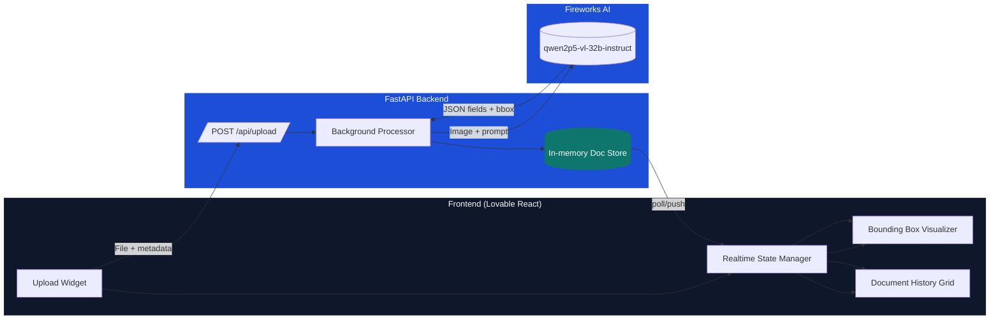

# Fireworks KYC Vision Snapshot

KYC PoC powered by Fireworks AI vision models.


## Replication Steps

1. Create & activate Python env
   ```bash
   python3.11 -m venv venv
   source venv/bin/activate
   ```
2. Install backend deps
   ```bash
   pip install -r requirements.txt
   ```
3. Add your Fireworks key
   ```bash
   export FIREWORKS_API_KEY="your_key"
   ```
4. Run FastAPI backend
   ```bash
   ./start_api.sh
   ```
5. Start Lovable dashboard
   ```bash
   cd dashboard
   npm install
   npm run dev
   ```
6. Open `http://localhost:5173`, upload an ID image, and watch Fireworks OCR drive the bounding-box view in real time.

## Demo Video


[](https://drive.google.com/file/d/1XhET9Fb1xxjjVIUdyn3srXS9JeEVgLKt/view?usp=sharing "View the full walkthrough on Google Drive")

Here's the demo: [View the video](https://drive.google.com/file/d/1XhET9Fb1xxjjVIUdyn3srXS9JeEVgLKt/view?usp=sharing).


## System Design

### OCR Flow (Prompts + Processing)

- **AI-driven pre-processing**: EXIF-aware orientation fixes, adaptive resizing, and dynamic channel normalization feed the model a normalized tensor every time.
- **Prompt-programmed extraction**: doc-type heuristics generate guardrailed prompts that spell out JSON schemas, bounding-box syntax, and “no masking” rules to steer the LMM.
- **Structured inference**: the Fireworks vision-language model returns typed fields with optional confidence hints and `[x1,y1,x2,y2]` provenance for each entity.
- **Post-processing & enrichment**: FastAPI validates the AI output, attaches latency/model metadata, and caches previews so the UI can visualize the model’s rationale in sync.


### Architecture View



## Model Choices & Deployment Modes

- **Serverless presets**
  - `accounts/fireworks/models/qwen2p5-vl-32b-instruct` (primary OCR with bbox fidelity)
  - `accounts/fireworks/models/qwen2-vl-72b-instruct` (broad context + multilingual support)
  - `accounts/fireworks/models/llava-v1.5-13b` (lightweight sanity checks)
- **On-demand deployments**
  - Plug in any custom Fireworks deployment ID (e.g., `accounts/myorg/models/passport-fast`)
  - Choose Fireworks shapes (Fast / Throughput / Minimal) to balance latency vs. cost
  - Enter the deployment path in the dashboard after selecting “On-demand”
- **Runtime switching**
  - Frontend sends `model` + `deployment_type` on every upload
  - FastAPI forwards those options directly to Fireworks, so serverless and on-demand share the same processing pipeline

## Internal Working


